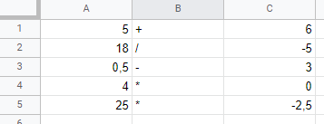

# Excel Webanwendung
Startet einen Web Service,die es dem Nutzer ermöglicht Aufgaben berechnen zu lassen . Als Eingabe dient eine Excel Datei (.xlsx). Sie enthält in einer Zeile je zwei Operanden und einen Operator im Format Operand | Operator | Operand.  

Als Ausgabe wird eine neue Excel Datei mit den Ergebnissen erstellt und über dem Browser heruntergeladen.

Um die Anwendung selbst zu bauen und zu starten: 

+ lade das Repository herunter
+ mvn install
+ java -jar target/excel-1.0.jar
+ im Webbrowser localhost:8080 aufrufen

Ansonsten aktuellen Release herunterladen und dann 

+ java -jar excel-1.0.jar 
+ localhost:8080 aufrufen

